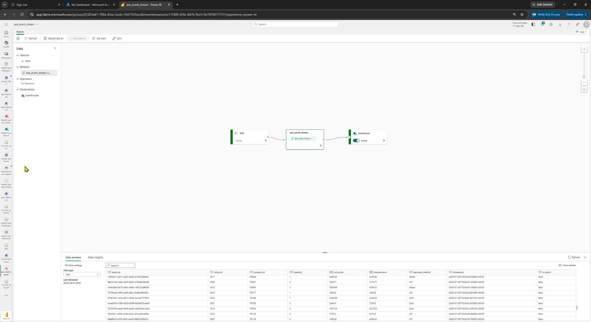
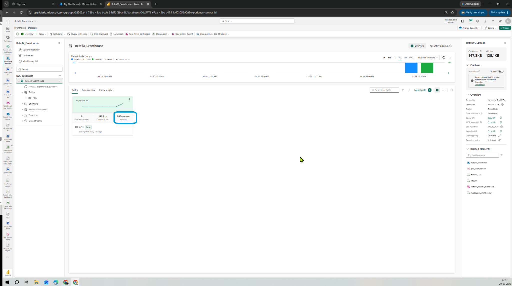
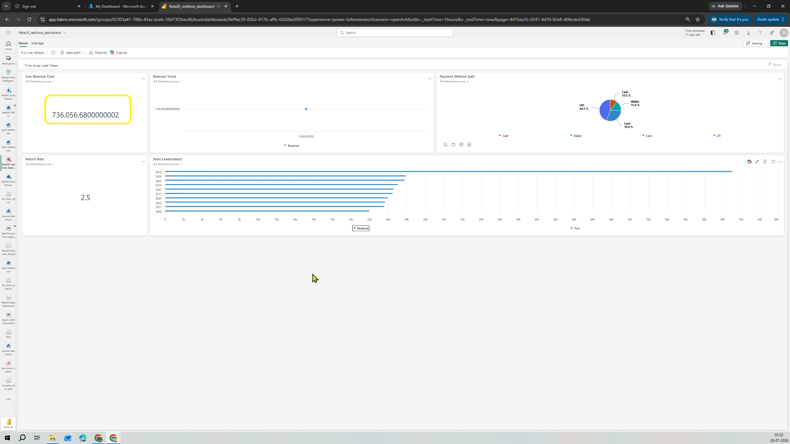
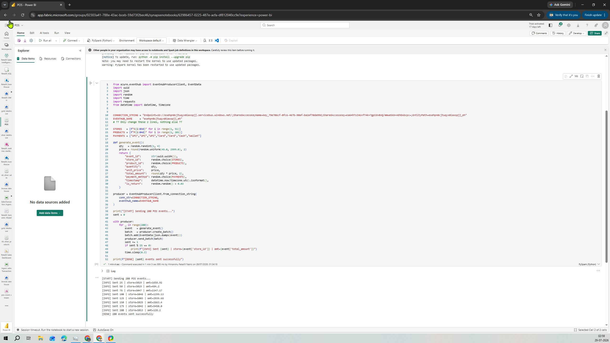
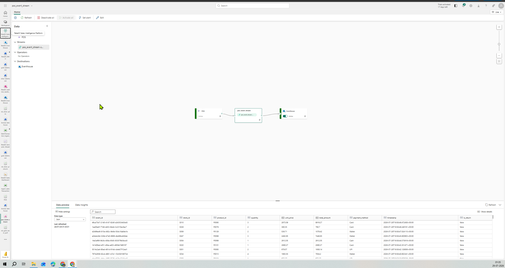
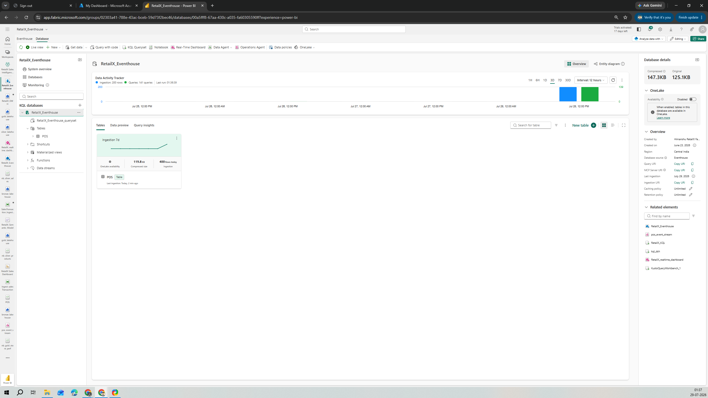
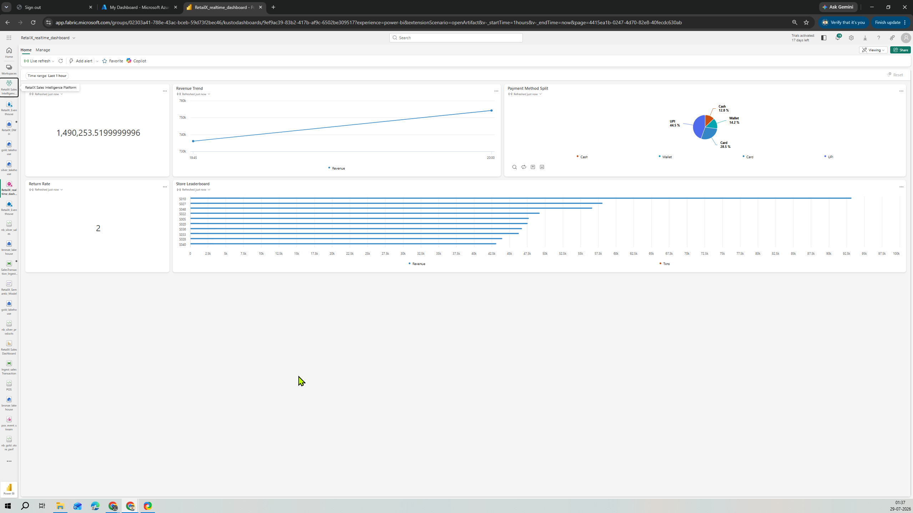

# Real-Time Pipeline Demonstration

This section demonstrates the complete real-time data flow:

POS Notebook
→ Fabric Eventstream
→ Eventhouse
→ POSEvents KQL Table
→ Real-Time Dashboard

1. Generate POS Events

The POS notebook generates simulated retail transactions.

Each notebook run sends:
200 events

POS Event generator
The notebook output confirms that all 200 events were sent successfully.

2. Eventstream Ingestion

The generated POS events are sent to Microsoft Fabric Eventstream.

The Eventstream contains:

Source: POS Custom App
Stream: POS event stream
Destination: RetailX Eventhouse
Status: Active

3. Eventhouse Destination

The events are stored in the POSEvents table inside RetailX_Eventhouse.

The Eventhouse preview confirms that the generated records reached the destination successfully.

4. First Dashboard Validation

After the first test run, the real-time dashboard reflected the newly ingested POS events.

The dashboard showed updated values for:

Live Revenue
Store Leaderboard
Revenue Trend
Payment Method Split
Return Rate

5. Run the POS Generator Again

The notebook was executed again to generate another 200 events.

The notebook returned:
[DONE] 200 events sent successfully.
This confirms that another batch of 200 events was sent to Eventstream.

6. Verify the Second Ingestion

The Eventstream and Eventhouse were refreshed to confirm that the second batch was ingested.

First run  = 200 events
Second run = 200 events
Total      = 400 events

Now eventhouse has 400 rows

7. Dashboard After Second Run

The real-time dashboard values increased after the second batch arrived.

This confirms that the dashboard responded to newly ingested events.

8. Validate the Final Event Count

The total number of rows was verified using KQL:

POSEvents
| count

The query returned: 800

The POS event generator had been executed four times:

4 runs × 200 events = 800 total events

This confirms that all generated events were successfully ingested through Eventstream and stored in Eventhouse.

Real-Time Validation Summary
POS notebook generated simulated events successfully
Eventstream source and destination remained active
Eventhouse stored the incoming events
KQL confirmed the final row count
The real-time dashboard updated when new events arrived

